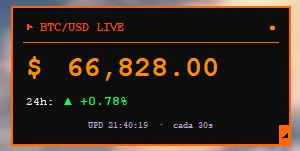

```
███████╗███████╗██╗      █████╗ ███████╗██╗  ██╗        ██╗  ██╗██╗ ██╗
██╔════╝██╔════╝██║     ██╔══██╗██╔════╝██║  ██║        ██║  ██║╚████╔╝
███████╗███████╗██║     ███████║███████╗███████║         ██║  ██║ ╚██╔╝
╚════██║╚════██║██║     ██╔══██║╚════██║██╔══██║         ██║  ██║  ██║
███████║███████║███████╗██║  ██║███████║██║  ██║▄▄▄▄▄▄▄ ╚████╔╝   ██║
╚══════╝╚══════╝╚══════╝╚═╝  ╚═╝╚══════╝╚═╝  ╚═╝         ╚════╝   ╚═╝
```

---

# ₿ BTC/USD Live Widget

> Widget retro para Windows que monitorea el precio del Bitcoin en tiempo real.

Creado con el propósito de tener siempre a mano el precio del BTC/USD sin abrir el navegador ni ninguna aplicación pesada. Un widget minimalista, discreto y con estética retro naranja que vive en tu escritorio.

---

## ✦ Características

- **Precio en tiempo real** — consulta la API de CoinGecko cada 30 segundos
- **Variación 24h** — muestra el porcentaje de cambio con flecha ▲ verde o ▼ roja
- **Diseño retro** — fondo negro, bordes y tipografía naranja, fuente monoespaciada
- **Siempre encima** — flota sobre todas las ventanas (activable/desactivable)
- **Redimensionable** — arrastrar el grip `◢` para achicar el widget hasta mostrar solo el precio
- **Reset de tamaño** — hacer clic en el símbolo `$` restaura el tamaño original
- **Sin CMD abierta** — el launcher `.vbs` inicia el widget sin dejar ninguna consola visible
- **Sin dependencias externas** — solo requiere Python 3 estándar (tkinter incluido)

---

## ✦ Vista previa



---

## ✦ Requisitos

- Windows 10 / 11
- [Python 3.8+](https://www.python.org/downloads/) — solo la instalación estándar, sin paquetes adicionales
- Conexión a internet

---

## ✦ Instalación y uso

1. Clonar o descargar el repositorio:
   ```bash
   git clone https://github.com/SlashUY/btcdskt.git
   ```

2. Ejecutar el widget con doble clic en:
   ```
   iniciar_btc_widget.vbs
   ```
   > No se abre ninguna ventana de CMD. El widget aparece directamente en la esquina inferior derecha del escritorio.

---

## ✦ Controles

| Acción | Resultado |
|---|---|
| Arrastrar el widget | Mover por el escritorio |
| Clic en `$` | Restaurar tamaño original |
| Arrastrar `◢` | Achicar el widget |
| Clic derecho | Menú contextual |
| Menú → Actualizar ahora | Fuerza una consulta inmediata |
| Menú → Siempre encima | Activa / desactiva prioridad de ventana |
| Menú → Cerrar | Cierra el widget |

---

## ✦ Fuente de datos

Los precios se obtienen de la [API pública de CoinGecko](https://www.coingecko.com/en/api) — gratuita, sin clave de API requerida.

---

## ✦ Archivos

```
btcdskt/
├── btc_widget.py          # Aplicación principal
└── iniciar_btc_widget.vbs # Launcher silencioso (sin CMD)
```

---

<div align="center">
  <sub>Hecho con Python · Diseño retro · Sin dependencias</sub>
</div>
